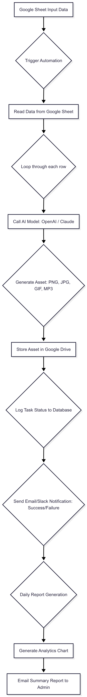

# Quy Trình Tự Động Hóa Tạo Tài Sản Game với AI

## 1. Ý Tưởng & Mục Đích 🚀

**Ý tưởng:** Xây dựng một hệ thống tự động hóa để nhanh chóng tạo ra các tài sản game (hình ảnh, âm thanh) bằng trí tuệ nhân tạo, dựa trên các yêu cầu từ Google Sheets.

**Mục đích:**
* **Tăng tốc độ sản xuất tài sản:** Giảm thời gian và công sức thủ công trong việc tạo ra game assets.
* **Tối ưu hóa quy trình:** Tự động hóa từ khâu nhập liệu đến lưu trữ và thông báo.
* **Sử dụng tài nguyên miễn phí/tiết kiệm chi phí:** Tận dụng các API AI có gói miễn phí để tối thiểu hóa chi phí phát triển.

---

## 2. Các Thành Phần Chính 🧩

Hệ thống được xây dựng bằng Python, chia thành các module với chức năng rõ ràng:

### 2.1. Nguồn Dữ Liệu: Google Sheets
* **`google_sheets_handler.py`**: Đọc các yêu cầu tạo tài sản (mô tả, định dạng, v.v.) từ một bảng tính Google Sheets được cấu hình.

### 2.2. Tạo Tài Sản AI: Các API Miễn Phí
* **`ai_model_generator.py`**: Trái tim của quá trình tạo tài sản.
    * **Hình ảnh (PNG/JPG)**: Sử dụng **Hugging Face Inference API** (ví dụ: mô hình Stable Diffusion) để tạo hình ảnh từ mô tả văn bản.
    * **Âm thanh (MP3)**: Sử dụng **Google Cloud Text-to-Speech API** để chuyển văn bản thành âm thanh.

### 2.3. Lưu Trữ & Quản Lý: Google Drive & SQLite
* **`google_drive_handler.py`**: Tải các tài sản đã tạo lên Google Drive.
    * Sử dụng **thư mục do tài khoản dịch vụ sở hữu** để vượt qua các giới hạn về hạn mức lưu trữ của tài khoản cá nhân.
* **`database_logger.py`**: Ghi lại chi tiết (thành công/thất bại, URL, lỗi) của từng tác vụ vào một cơ sở dữ liệu SQLite cục bộ.

### 2.4. Thông Báo & Báo Cáo: Email & Slack
* **`notification_handler.py`**: Gửi thông báo tức thì qua Email và Slack sau mỗi tác vụ hoàn thành.
* **`report_generator.py`**: Tổng hợp dữ liệu log hàng ngày, tạo biểu đồ phân tích tỷ lệ thành công/thất bại và gửi báo cáo tổng kết qua Email cho quản trị viên.

### 2.5. Điều Phối Chính
* **`main_workflow.py`**: Điều phối toàn bộ quy trình: đọc yêu cầu, kích hoạt tạo tài sản, lưu trữ, ghi log, gửi thông báo và tạo báo cáo.

---

## 3. Quy Trình Hoạt Động (Flow Diagram) 🔄

Sơ đồ dưới đây minh họa luồng dữ liệu và xử lý của hệ thống:

